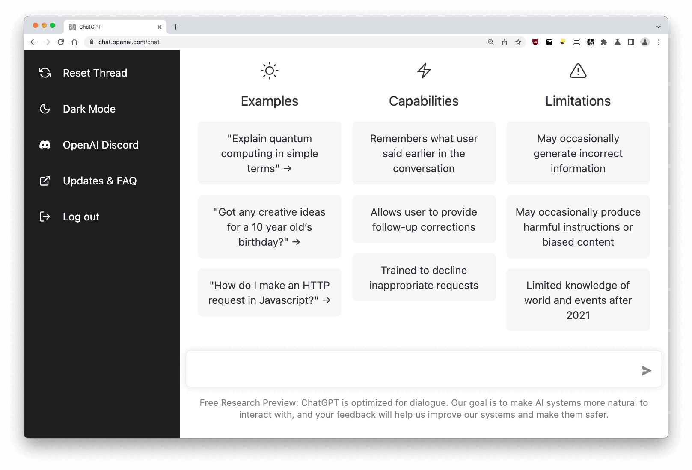

<!-- embed: v1.html -->
<!-- embed-height: 400 -->
<!-- embed-step: 1 -->
<!-- background: priprompt.png -->

## El primer prompt (ChatGPT 3 - Nov 2022)

***hazme una app para mostrar mis notas***
<!-- reveal -->
*¿Alguien usaría esto en un proyecto real?*

> **Nota del presentador:** Muestra esa app rápida. Es fea, básica. Pregúntales: "¿Le cobrariais a un cliente por esto?". Obviamente no.
